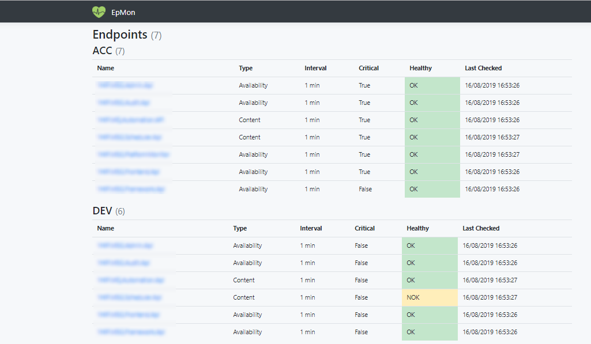

# EpMon
EpMon (short for EndpointMonitor) is a tool for http health endpoint monitoring and alerting.

The tool offers a solution to monitor multiple http endpoints that implement the ["Health Endpoint Monitoring Pattern"](https://docs.microsoft.com/en-us/azure/architecture/patterns/health-endpoint-monitoring).

# Screenshot

